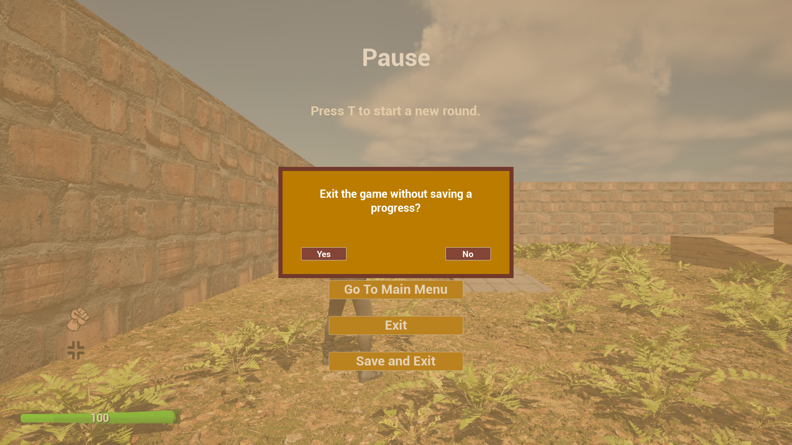

# Reign Force

<p align="center">
  <a href="https://github.com/andrew1407/ReignForce/releases">
    
  </a>
</p>

## Description

This UE 5.3 prject is a third-person shooter game using reinforcement learning to train enemy AI. It is a practical part of the **[master's thesis](https://ela.kpi.ua/items/944163bd-9528-4faf-b506-f0f11145addc)**.

There's two game modes to handle reinforcement learning using **[AICommandsStrategy](./Source/ReignForce/Public/ReinforcementLearning/Interfaces/AICommandsStrategy.h)** interface to request a predicted command for enemy AI:

1. **[AILearningGameMode](./Source/ReignForce/Public/GameModes/AILearningGameMode.h)** uses WebSocket connection to train model on a server during gameplay collecting and operating gained episodic data experience bunches.

2. **[AIModelsGameMode](./Source/ReignForce/Public/GameModes/AIModelsGameMode.h)** loads and then connects to pre-trained model(s) of ONNX format (uses NNE plugin to load runtime models).

There are [three behavioral patterns](./Source/ReignForce/Public/ReinforcementLearning/TemperamentType.h) (temperament types) to estimate enemy AI action for a reward, and each of them has its own estimator for it:

- [Agressive](./Source/ReignForce/Private//ReinforcementLearning/RewardEstimators/RewardEstimatorAgressive.cpp)
- [Retreat](./Source/ReignForce/Private//ReinforcementLearning/RewardEstimators/RewardEstimatorRetreat.cpp)
- [Moderate](./Source/ReignForce/Private//ReinforcementLearning/RewardEstimators/RewardEstimatorModerate.cpp)

The game modes and temperament types can be switched and set up in Unreal Editor. Here's a scheme of **VLAD** (validate, learn, act, distinguish) system:


To train the model the project is presented as a thick client using WebSocket protocol. It connects to the Python WebSocket server (see more [here](./TrainigServer/)).

## Scripts

The project contains three .bat scripts for Windows platforms for a process automation in the **[ScriptsWin](./ScriptsWin)** folder. All main configurable parameters are present in teh **[config.bat](./ScriptsWin/config.bat)** script.

1. To run project compilation use **[run.bat](./ScriptsWin/run.bat)**:

```batch
.\ScriptsWin\run.bat <mode>
```

or (from the ScriptsWin dir):

```batch
.\run.bat <mode>
```

It can take one optional argument for unreal run mode. By default it runs editor dev. build.

2. To run tests use **[test.bat](./ScriptsWin/test.bat)**:

```batch
.\ScriptsWin\test.bat <testname> <skipbuild>
```

or (from the ScriptsWin dir):

```batch
.\test.bat <testname> <skipbuild>
```

It can take one optional argument for unreal run mode:
+ Test context name; by default runs all; besides exact test name the script argument takes **"projectonly"** option to run ReignForce tests only (this tests are contained in the **[tests](./Source/ReignForce/Private/Tests/)** dir);
+ Skip build flag; by default accomplishes the build; by passing **"skipbuild"** trigger test only (without build) otherwise the script runs build before tests; 

3. To build game use **[build_game.bat](./ScriptsWin/build_game.bat)**:

```batch
.\ScriptsWin\build_game.bat <mode>
```

or (from the ScriptsWin dir):

```batch
.\build_game.bat <mode>
```

An optional flag here is a build mode which is set as **"Shipping"** by default; can be defined as **"Development"** as well.

## Gameplay

### Main menu

Default (without game progress saves):


Default (with game progress saves):


Exiting confirmation modal window:


Play the new game having previous game saves confirmation modal window:


### Gameplay

Gameplay on a main map (melee attack):


Gameplay on a main map (firearms attack):


Saving game during gameplay (success):


Saving game during round, when it's started (failure):


### Skills (progression) menu


### Pause menu

Pause menu during main game:


Save progress connfirmation modal window:


Save progress (success):


Save progress (failure):


Restart level connfirmation modal window:


Go to the main menu connfirmation modal window:


Exiting game connfirmation modal window:



Exiting game and saving a progress connfirmation modal window:


