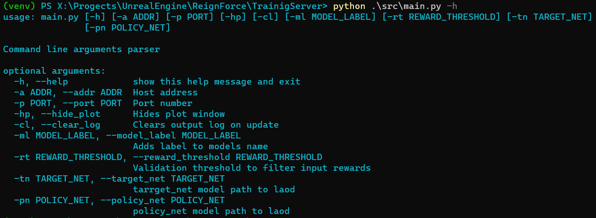
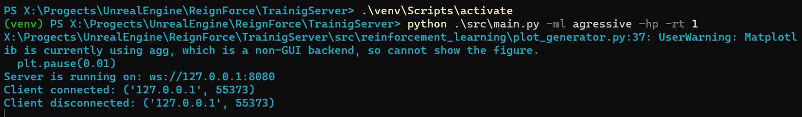
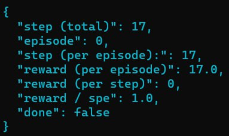

# ReignForce Training Server

## Description

The project uses Python 3.9.7.

This Python server runs on WebSocket protocol is used to deal with reinforcement learning algorithms. Its main goal is to take socket JSON message parsing it, and use the gained info as metrics to train **policy_net** and **target_net** neural networks. As a response connection returns a predicted AI command value.

The app contains many layers (classes, modules) to works with data: plotting, running the server, handling client request/response, train models, validate & format data etc. Here's a diagram of the program's dependencies connections:


## Scripts

Console commands listed below are a showcase only for **Windows OS**.

**Create venv:**
```batch
python3.9.7 -m venv venv
```

**Activate venv:**
```batch
source venv\Scripts\activate
```

**Dectivate venv:**
```batch
deactivate
```

**Install dependencies:**
```batch
pip install -r requirements.txt
```

**Run the script:**
```batch
python .\src\main.py
```

## Usage

Flags to set when run main:



The server starts and a client connects/disconnects:



Step log info during reinforcement learning (models training):


